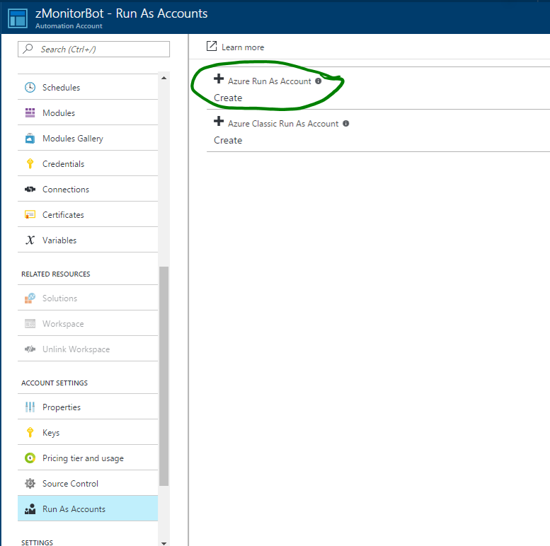
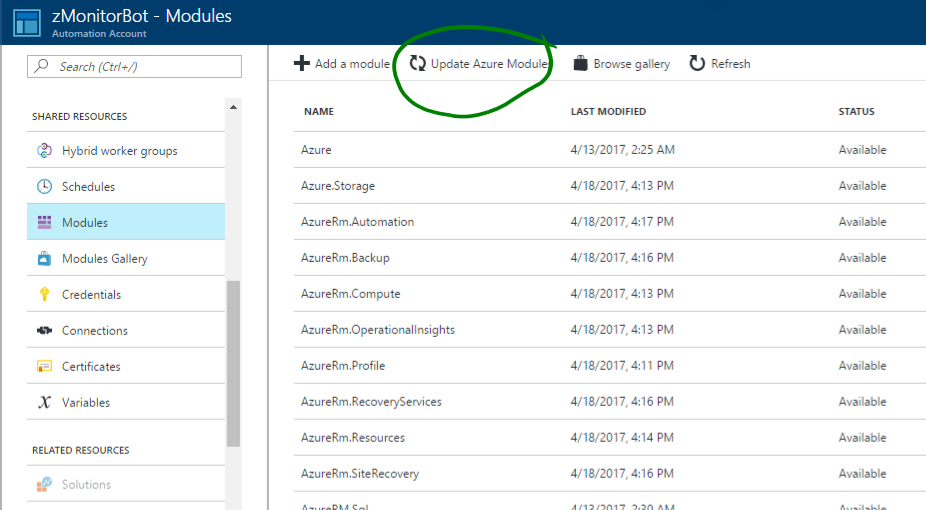
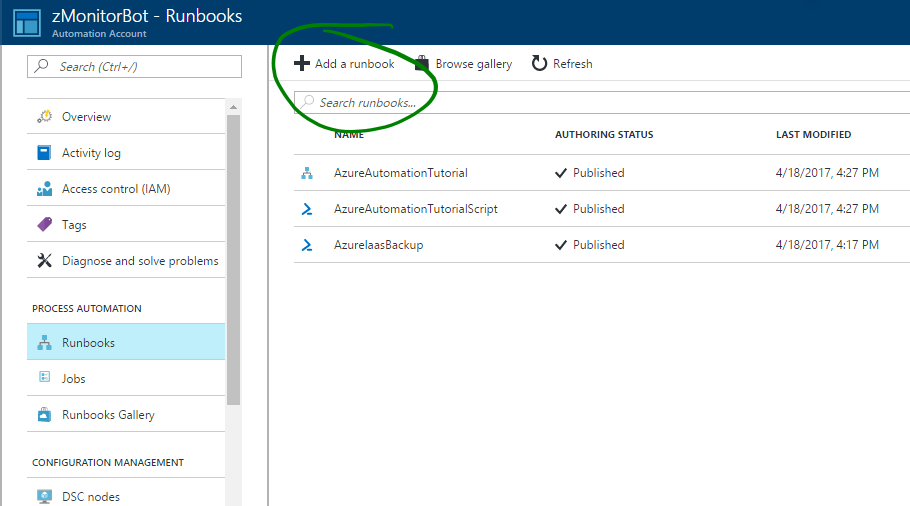
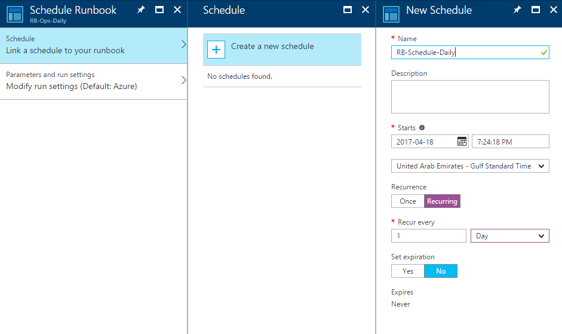

# zMonitor

## Tenant \ Subscription Deployment

Tenant \ subscription operations monitoring is enabled through Operations Management Suite (OMS). What you monitor and report on is dependent on the solutions and agents deployed and how monitoring is configured per workload in each tenant.

Monitoring is enabled using two core Azure components:

* Azure Log Analytics (OMS)
* Azure Automation

The overall process for tenant monitoring is:

1. Configure Log Analytics
1. Define Log Analytics queries to extract the monitoring information required
1. Schedule Azure Automation runbooks to execute queries and upload to service provider

## Deployment

1. Deploy OMS components (zMonitorDeploy.ps1)

    Execute PowerShell deployment of ARM template.

    1. Update script with relevant parameters:
    ```PowerShell
    $TenantID = "<TenantID>"
    $SubscriptionID = "<Tenant's SubscriptionID>"
    $resourceGroupName = "zMonitor"
    $resourceRegion = "West Europe"
    $templateFilePath = "<path to file>\azuredeploy.json"
    ```
    1. Execute PowerShell script.
    1. Login with CSP administrator account.
    1. During execution you will be prompted for several additional parameters, or update the param file and specify in PowerShell script:
    ```PowerShell
    omsRecoveryVaultName: <e.g. zMonitorVault>
    omsWorkspaceName: <Tenant Name>
    omsAutomationAccountName: <e.g. zMonitorBot>
    azureadmin: <whatever>
    azureAdminPwd: <whatever>
    ```
    NOTE: Ensure that the omsWorkspaceName is the same as the tenant name, for example, if registered tenant name is tenant1.onmicrosoft.com, then make the omsWorkspaceName "tenant1". The omsWorkspace name is how you uniquely identify subscriptions or tenants.

    1. Wait for script execution to complete (takes about 10 minutes).

1. Config Azure Log Analytics

    Under Log Analytics, go through and configure all the Workspace Data Sources and ensure everything you want to monitor has been added. Ensure you also configure the log collection from storage account logs.

1. Configure Azure Automation

    Take your time through this section. The components need time to register and come online.

    1. Create Run As Account

        

    1. Update Azure Modules

        

    1. Update storage settings in "RB-ProcessLogs.ps1"

        ```PowerShell
        # Set service provider Azure storage account and get the context
        $StorageAccountName = "<serviceproviderstorageaccountname>"
        $StorageContainerName = "<privatecontainer>"
        $StorageAccountKey = "<storageaccountkey>"
        ```
        These are the settings in the service providers BLOB storage account.

    1. Import existing runbooks

        

        Repeat for all scripts:
        * RB-Ops-Daily.ps1
        * RB-Ops-Hourly.ps1
        * RB-ProcessLogs.ps1

        For each of the imported runbooks, open the Runbook blade, click "Edit" then "Publish".

        Then create and link schedules for the Daily and Hourly scripts:

        

        To ensure everything is properly configured, run the following runbooks once, and validate output:
        * RB-Ops-Daily.ps1
        * RB-Ops-Hourly.ps1

        ALL SET!

1. (Optional) Customize

    This solution is designed to be highly scalable and flexible. If you can query it in Log Analytics, you can report on it in zMonitor. The included queries today are documented [here](Log-Reports.md). To this end, feel free to customize the data collection queries, by editting :

    * RB-Ops-Daily.ps1 - for queries that run daily
    * RB-Ops-Hourly.ps1 - for queries that run hourly

    Or you can create additional PowerShell scripts for other intervals/schedules, if desired.
